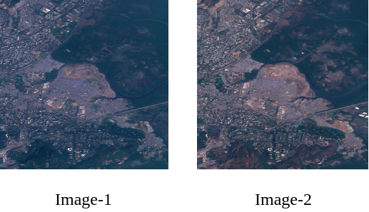
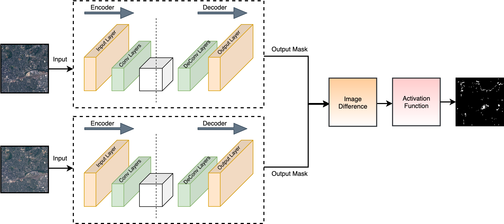
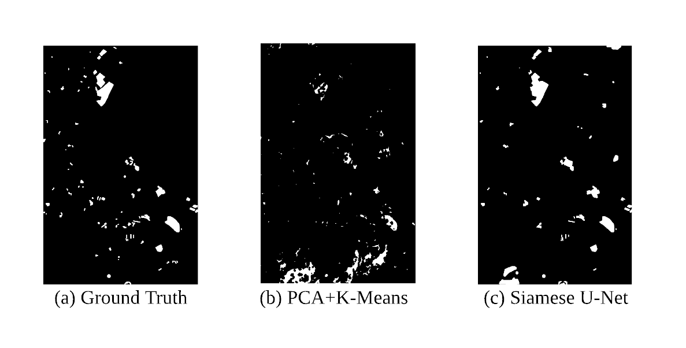
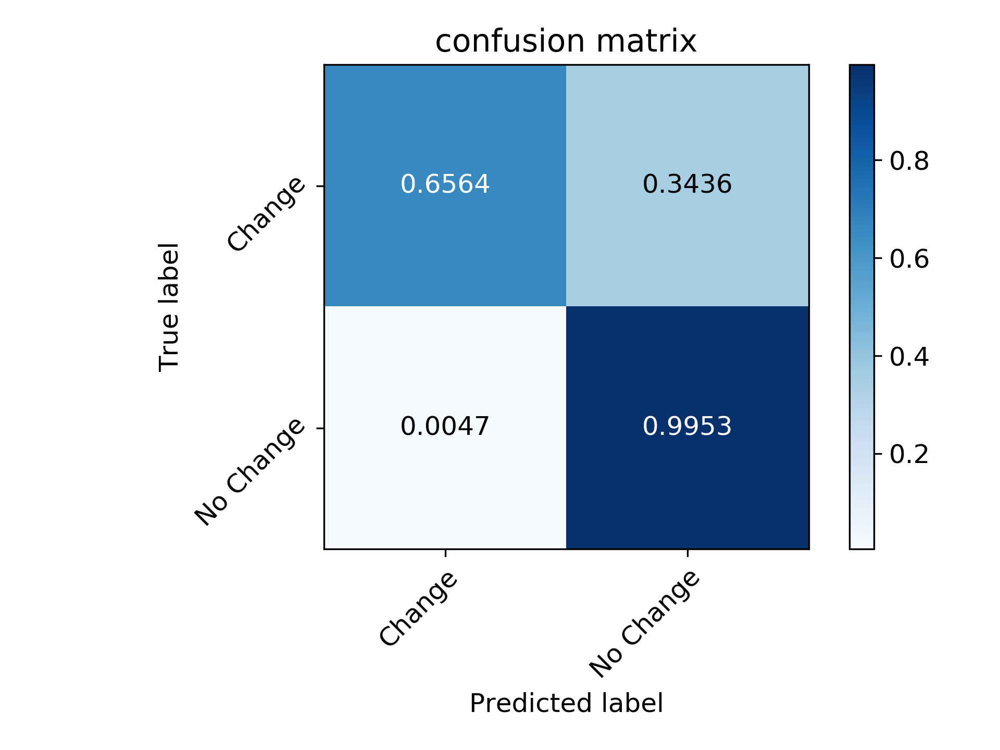

# Urbanization Change Detection

Urbanization detection using computer vision algorithms
to reduce the reliance on the data of government
surveys, which will speed up the policy making
process.

## Requirements
The code has been tested on:

- 1-Nvidia P100 GPU
- Ubuntu 18.04 LTS
- [Pytorch](https://pytorch.org/) v0.4.0
- Opencv 3.0

## Input Images



## Architecture
<!--  -->
<!--  -->


## Urbanization detection output





## Multidate Sentinel-2 dataset

1. [OSCD](https://rcdaudt.github.io/oscd/)

## Contact
For any queries, please contact
```
Ashish Sethi: ashish18024@iiitd.ac.in
```


